# <ins>**2420 Week 12 Lab**</ins>

This repo contains an html document file and a server block file accommodated for Nginx.

In this README, you will be building and setting up your own web server, and presenting your document onto a web browser.

You will be using DigitalOcean droplets and Nginx web server to display your content and your application to the browser.

---

## <ins>**1. Table of Contents**</ins>

- [**2420 Week 12 Lab**](#2420-week-12-lab)
  - [**1. Table of Contents**](#1-table-of-contents)
  - [**2. Set B Members**](#2-set-b-members)
  - [**3. Technologies Used**](#3-technologies-used)
  - [**4. Prerequisites**](#4-prerequisites)
  - [**5. Installing Nginx**](#5-installing-nginx)
  - [**Creating Files**](#creating-files)
    - [**Creating an HTML Document**](#creating-an-html-document)
    - [**Creating Nginx Server Block**](#creating-nginx-server-block)
  - [**Moving Files to your Server**](#moving-files-to-your-server)
  - [**Moving and Configuring Files**](#moving-and-configuring-files)
    - [**Moving HTML Document**](#moving-html-document)
    - [**Moving and Configuring Server Block**](#moving-and-configuring-server-block)
  - [**Checking the Application**](#checking-the-application)
  - [**Adding a Cloud Firewall**](#adding-a-cloud-firewall)
  - [**Conclusion**](#conclusion)
- [**Go to top**](#go-to-top)

---

## <ins>**2. Set B Members**</ins>

Nazira Fakhrurradi (A01279940)  
Aaron Matthew Arcalas

---

## <ins>**3. Technologies Used**</ins>

- Bash
- Windows Subsystem for Linux (WSL) - Ubuntu
- DigitalOcean (DO)
- Nginx
- Git
- HTML
- Windows Terminal or Powershell

---

## <ins>**4. Prerequisites**</ins>

- You have `WSL Ubuntu` installed and have created a regular user inside it.
- You have created a DO droplet `web-one` server and have created a regular user.
- You can connect via ssh from `WSL` to regular user in `web-one`.
- You can connect via ssh from `Windows Terminal` or `Powershell` to regular user in `WSL`.

---

## <ins>**5. Installing Nginx**</ins>

> **Note:** You may need to open your Terminal as Administrator.

From your Windows Terminal or Powershell, connect to `WSL`, then connect to `web-one`.

1. Update any packages currently installed on `web-one`:

```
username@web-one:~$ sudo apt update
```

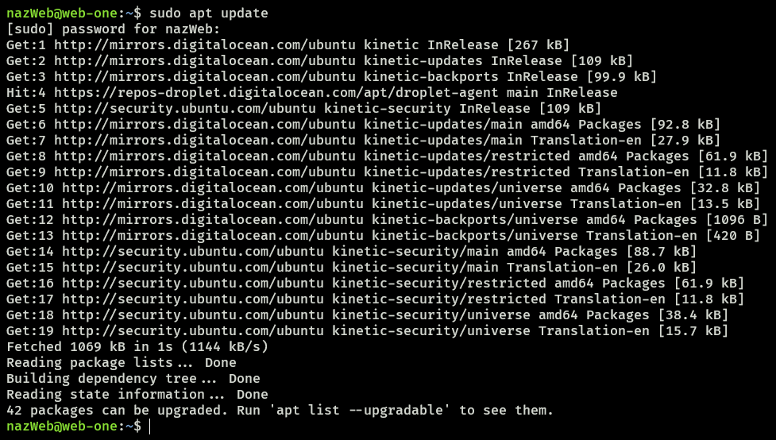

2. Upgrade currently installed packages:

```
username@web-one:~$ sudo apt upgrade
```

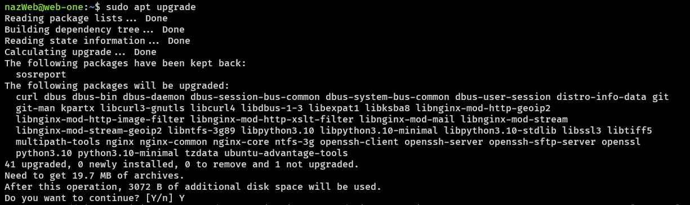

3. To confirm changes, press `TAB` and then `ENTER`:

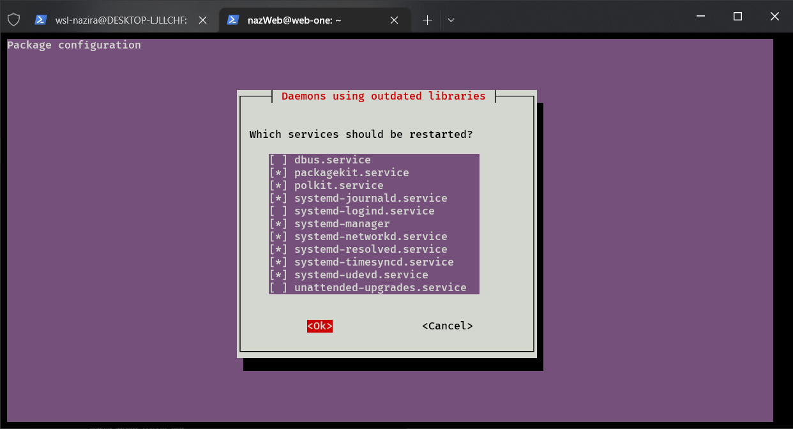

4. Finally, install `nginx`:

```
username@web-one:~$ sudo apt install nginx
```

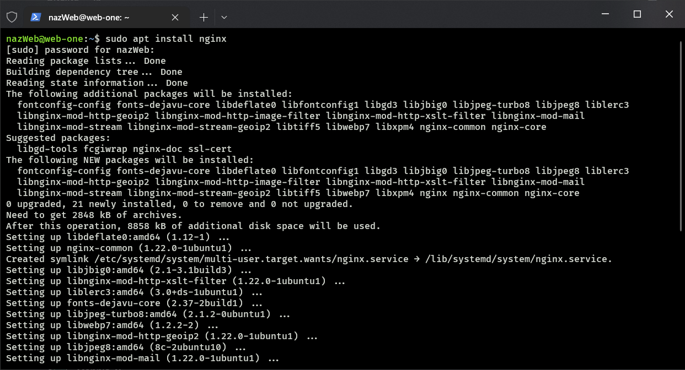

> **Note:** If you are prompted to restart services, press `TAB` and then `ENTER`.

5. Check if `nginx` is successfully installed:

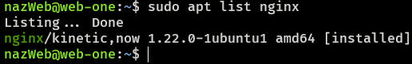

---

## <ins>**Creating Files**</ins>

### <ins>**Creating an HTML Document**</ins>

Within `WSL`, you will create an HTML file in a logical directory. You will be sending this file to `web-one`, eventually.

1. Create an `index.html` file with your own content:

```
username@DESKTOP:/mnt/c/Users/...$ vim index.html
```

- For example:

```
<!DOCTYPE html>
<html lang="en">
<html>
    <head>
    <meta charset="UTF-8" />
        <title>This is my website!</title>
    </head>
    <body>
        <h1>Success! The application has been created!</h1>
        <h2 style="color: red;">This is a heading 2 and it is red!</h2>
    </body>
</html>
```

1. Check the file's content:

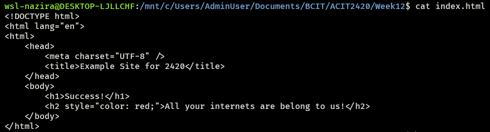

---

### <ins>**Creating Nginx Server Block**</ins>

The server block file is used to serve your HTML document that you created from [**Creating an HTML Document**](#creating-an-html-document).

1. Within `WSL`, create a text file with your DO droplet's IP Address as the name:

```
username@DESKTOP:/mnt/c/Users/...$ vim <IP_ADDRESS>
```

2. Write the following content to the file:

> **IMPORTANT:** `<IP_ADDRESS>` should be your server's IP Address. (E.g., 137.184.15.57)

```
server {
        listen 80;
        listen [::]:80;

        root /var/www/<IP_ADDRESS>/html;
        index index.html;

        server_name <IP_ADDRESS>;

        location / {
                try_files $uri $uri/ =404;
        }
}
```

1. Check the file's content:

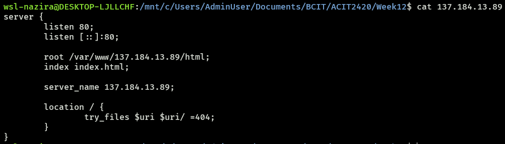

---

## <ins>**Moving Files to your Server**</ins>

1. From `WSL`, connect to `web-one` via sftp.
2. Copy the two files `index.html` and `<IP_ADDRESS>` into your home directory in `web-one`:

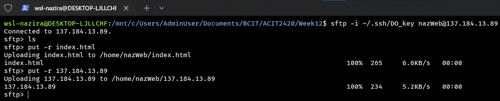

3. Check the output on `web-one`:

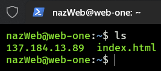

---

## <ins>**Moving and Configuring Files**

### <ins>**Moving HTML Document**</ins>

1. In `web-one`, make a new directory for `index.html`:

```
username@web-one:~$ sudo mkdir -p /var/www/<IP_ADDRESS>/html
```

2. Move `index.html` to the newly-created directory:

```
username@web-one:~$ sudo mv ~/index.html /vaw/www/<IP_ADDRESS>/html/
```

3. Check if file has been moved:

```
username@web-one:~$ ls /var/www/<IP_ADDRESS>/html/index.html
```

---

### <ins>**Moving and Configuring Server Block**</ins>

1. In `web-one`, move `<IP_ADDRESS>` to the nginx sites available directory:

```
username@web-one:~$ sudo mv ~/<IP_ADDRESS> /etc/nginx/sites-available/
```

2. Check if file has been moved:

```
username@web-one:~$ ls /etc/nginx/sites-available/
```

3. Create a symbolic link and test your configuration:

```
username@web-one:~$ sudo ln -s /etc/nginx/sites-available/<IP_ADDRESS> /etc/nginx/sites-enabled/
username@web-one:~$ sudo nginx -t
```

Desired Output:  

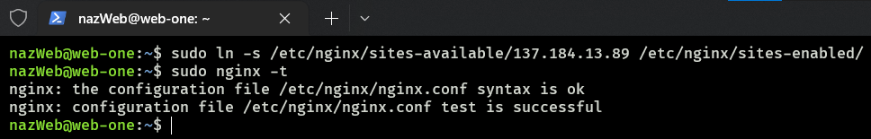

4. Check if the link is green:

```
username@web-one:~$ ls -l /etc/nginx/sites-enabled/
```

Desired Output:  

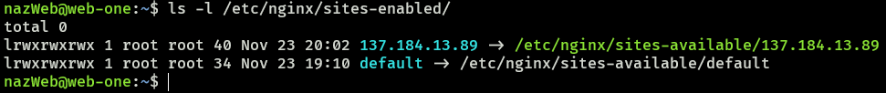

5. Reload `nginx`:

```
username@web-one:~$ sudo systemctl reload nginx
```

---

## <ins>**Checking the Application**</ins>

- Check if your HTML document is being served by visiting your server's IP Address on your browser.

Example output:  

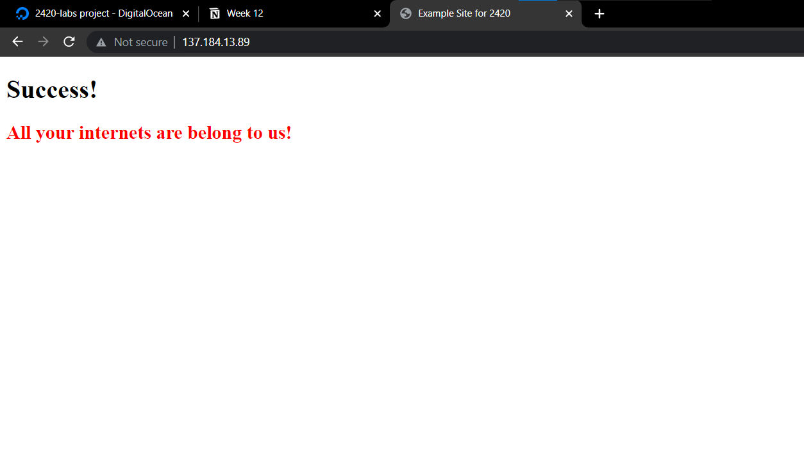

## <ins>**Adding a Cloud Firewall**</ins>

For this step, you will be using DO to create a Cloud Firewall for your application.

1. Click the green `Create` dropdown button and click `Cloud Firewalls`:

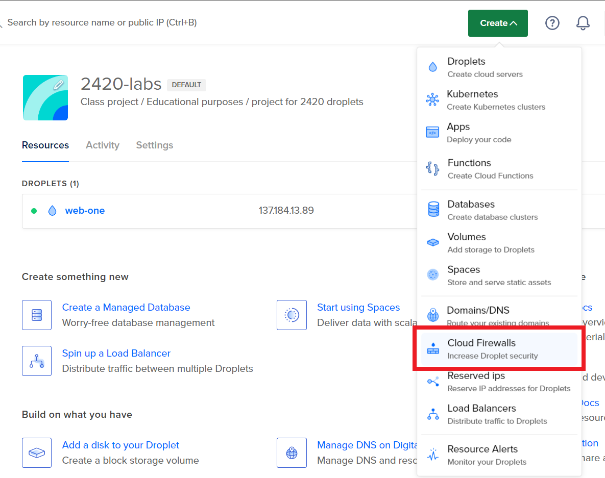

2. Enter a `name`, and allow incoming `HTTP` and `SSH` connections:

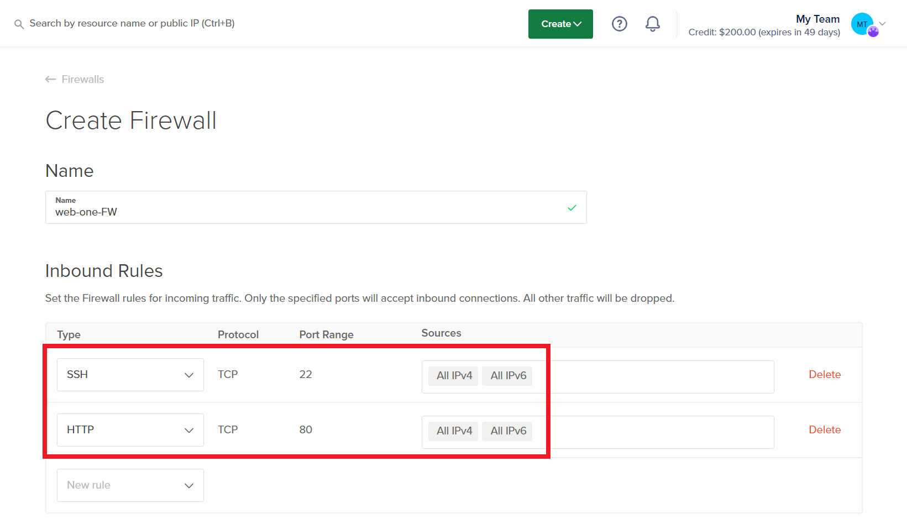

3. Apply the firewall to your server and create the firewall:

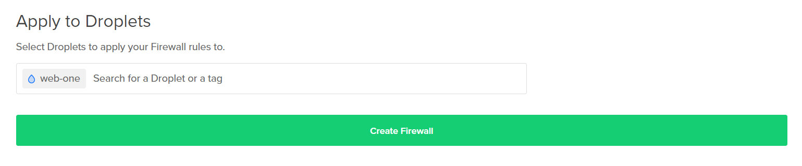

4. Check if the firewall has been successfully created:

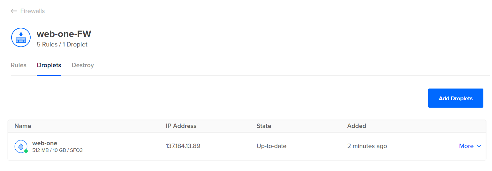

---

## <ins>**Conclusion**</ins>

Good job. You have successfully created your own web server with a firewall using DigitalOcean.

You can send your server's IP Address to your friends and they'll be able to view your application.

Since you allowed incoming SSH connections, you are the only one who can connect via SSH to your application.

---

# [<ins>**Go to top**</ins>](#2420-week-12-lab)